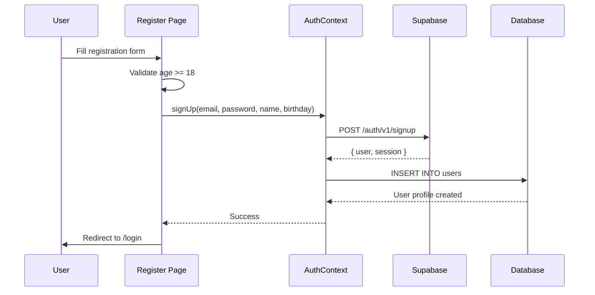
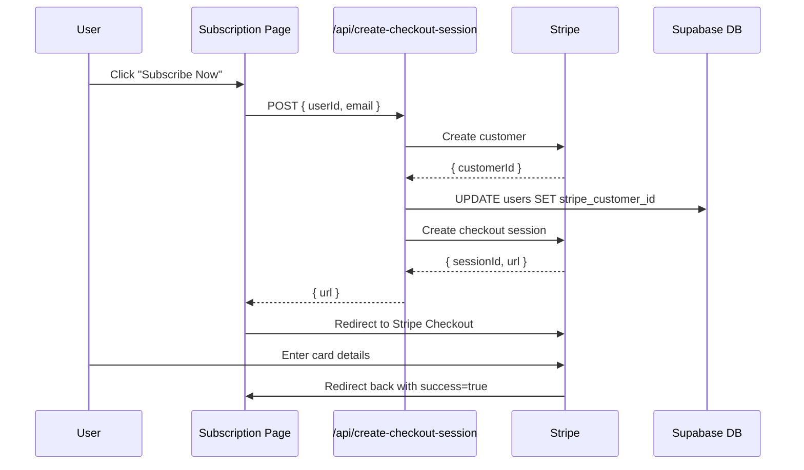
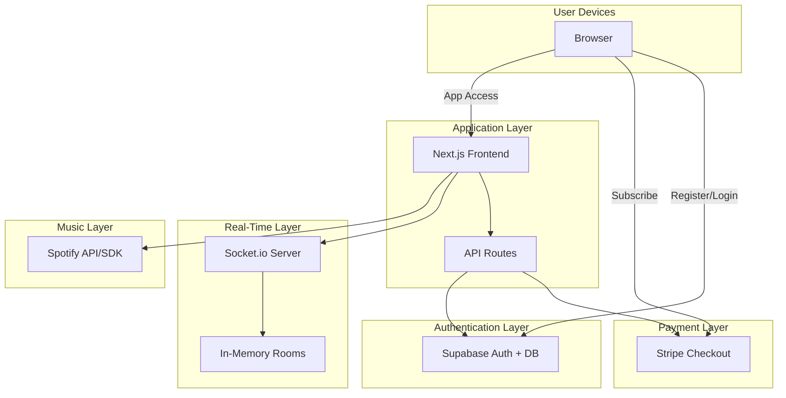

# Specification Updates - Supabase & Stripe Integration

**Date:** November 24, 2025
**Changes:** Added Supabase authentication, Stripe payments, and Render deployment support

This document provides updates to all specification files in the `/specs` folder. Append this information to the existing specs.

---

## 1. CODE-BASE-ANALYSIS.MD UPDATES

### Updated Stats:
- **Total Lines of Code:** ~1,959 lines (was 1,527)
- **New Files Added:** 9 files
- **Modified Files:** 3 files

### New Directory Structure:

```
surroundsound/
├── app/
│   ├── register/              # NEW: User registration page
│   │   └── page.tsx           # 190 lines
│   ├── login/                 # NEW: User login page
│   │   └── page.tsx           # 135 lines
│   ├── subscription/          # NEW: Stripe payment page
│   │   └── page.tsx           # 235 lines
│   ├── api/                   # NEW: API routes
│   │   └── create-checkout-session/
│   │       └── route.ts       # 65 lines
│   └── [existing files]
├── contexts/
│   ├── AuthContext.tsx        # NEW: Supabase auth (130 lines)
│   └── [existing files]
├── lib/
│   ├── supabase.ts            # NEW: Supabase client (30 lines)
│   ├── stripe.ts              # NEW: Stripe client (12 lines)
│   └── [existing files]
├── SUPABASE_SETUP.md          # NEW: Database setup guide
├── RENDER_DEPLOYMENT.md       # NEW: Deployment guide
├── CHANGES_SUMMARY.md         # NEW: Change documentation
└── render.yaml                # NEW: Render config
```

### Updated File Breakdown:

**New Files:**
| File | Lines | Purpose |
|------|-------|---------|
| `/app/register/page.tsx` | 190 | User registration with birthday validation (18+) |
| `/app/login/page.tsx` | 135 | User login page |
| `/app/subscription/page.tsx` | 235 | Stripe subscription page ($4.99/month) |
| `/app/api/create-checkout-session/route.ts` | 65 | Stripe checkout API |
| `/contexts/AuthContext.tsx` | 130 | Supabase authentication context |
| `/lib/supabase.ts` | 30 | Supabase client & utilities |
| `/lib/stripe.ts` | 12 | Stripe configuration |
| `SUPABASE_SETUP.md` | N/A | Database schema documentation |
| `RENDER_DEPLOYMENT.md` | N/A | Deployment guide |

**Modified Files:**
| File | Changes |
|------|---------|
| `/app/page.tsx` | Added auth checks, personalized welcome message |
| `/components/Providers.tsx` | Added AuthProvider wrapper |
| `.env.example` | Added Supabase & Stripe variables |

---

## 2. DATA-FLOW-ANALYSIS.MD UPDATES

### NEW Section: Authentication Flow (Before Spotify)

**Step 1: User Registration**

```
User opens app (any URL)
  → Redirected to /login or /register
  → User fills registration form:
      - Full Name: "John Doe"
      - Email: "test@example.com"
      - Birthday: "1990-01-01" (must be 18+)
      - Password: "password123" (min 6 chars)
  → Client validates age (calculateAge function)
  → Call AuthContext.signUp()
  → Supabase creates auth.users record
  → Insert into users table (profile data)
  → Redirect to /login
```

**Files Involved:**
- `/app/register/page.tsx:48` - handleSubmit validation
- `/lib/supabase.ts:8` - calculateAge function
- `/contexts/AuthContext.tsx:72` - signUp function

**Step 2: User Login**

```
User visits /login
  → Enters email + password
  → Call AuthContext.signIn()
  → Supabase validates credentials
  → Sets session cookie
  → Fetches user profile from users table
  → Updates AuthContext state
  → Redirects to /subscription
```

**Files Involved:**
- `/app/login/page.tsx:31` - handleSubmit
- `/contexts/AuthContext.tsx:103` - signIn function
- `/contexts/AuthContext.tsx:55` - fetchUserProfile

**Step 3: Subscription Page**

```
User at /subscription
  → Checks userProfile.has_active_subscription
  → If false: Show subscription options
  → User clicks "Subscribe Now"
  → Client calls /api/create-checkout-session
  → Server creates Stripe customer (if new)
  → Server creates Stripe checkout session
  → Redirect to Stripe Checkout
  → User enters test card: 4242 4242 4242 4242
  → Stripe redirects back to /subscription?success=true
  → (Future: Webhook updates has_active_subscription)
```

**Files Involved:**
- `/app/subscription/page.tsx:59` - handleSubscribe
- `/app/api/create-checkout-session/route.ts:9` - POST handler
- `/lib/stripe.ts:6` - Stripe client config

**Step 4: Main App (Updated)**

```
User navigates to / (home)
  → AuthContext checks user session
  → If no user: redirect to /login
  → If no Spotify token: show "Connect Spotify"
  → Display: "Welcome, {userProfile.full_name}!"
  → Continue with existing room functionality
```

**Files Involved:**
- `/app/page.tsx:17` - useEffect auth check
- `/app/page.tsx:126` - Personalized welcome message

### Updated Main Action Flow

**NEW: Complete flow from registration to playing music**

```
1. Registration → Login → Subscription (optional) → Spotify Auth
2. Home (now shows user's name instead of "Dude Person")
3. Create/Join Room (unchanged)
4. Play Track (unchanged)
5. Synchronization (unchanged)
```

### NEW Section: Database Operations

**Supabase Operations:**

| Operation | Trigger | File | Function |
|-----------|---------|------|----------|
| Create user profile | After registration | AuthContext.tsx:83 | signUp() |
| Fetch user profile | After login | AuthContext.tsx:55 | fetchUserProfile() |
| Update Stripe customer ID | During subscription | route.ts:35 | POST /api/create-checkout-session |

**Database Schema:**

```sql
users table:
  - id (UUID, primary key, links to auth.users)
  - email (TEXT, unique)
  - full_name (TEXT)
  - birthday (DATE)
  - has_active_subscription (BOOLEAN, default false)
  - stripe_customer_id (TEXT, nullable)
  - created_at (TIMESTAMP)
  - updated_at (TIMESTAMP)
```

---

## 3. ARCHITECTURE-PATTERN.MD UPDATES

### NEW: Three-Tier Architecture

**Previous Architecture:** Client-Server with WebSocket Hub
**Current Architecture:** Three-Tier with Authentication & Payment Layers

```
┌─────────────────────────────────────────┐
│  TIER 1: Authentication & Payment       │
│  - Supabase (User management)           │
│  - Stripe (Subscriptions)               │
└─────────────────────────────────────────┘
                  │
                  ▼
┌─────────────────────────────────────────┐
│  TIER 2: Application Layer              │
│  - Next.js Frontend                     │
│  - React State Management               │
│  - Spotify Integration                  │
└─────────────────────────────────────────┘
                  │
                  ▼
┌─────────────────────────────────────────┐
│  TIER 3: Real-Time Coordination         │
│  - WebSocket Server (Socket.io)         │
│  - In-Memory Room Storage               │
└─────────────────────────────────────────┘
```

### NEW Components Added

**Component 5: Authentication Layer (Supabase)**

**What it is:** User authentication and profile management

**Key Files:**
- `/contexts/AuthContext.tsx` - Auth state management
- `/lib/supabase.ts` - Supabase client
- `/app/register/page.tsx` - Registration UI
- `/app/login/page.tsx` - Login UI

**Responsibilities:**
1. User registration with age validation (18+)
2. Email/password authentication
3. Session management
4. User profile storage (name, birthday, subscription status)

**What it does NOT do:**
- ❌ Handle Spotify authentication (separate)
- ❌ Process payments (Stripe does this)
- ❌ Manage rooms (server does this)

**Component 6: Payment Layer (Stripe)**

**What it is:** Subscription and payment processing

**Key Files:**
- `/lib/stripe.ts` - Stripe configuration
- `/app/subscription/page.tsx` - Subscription UI
- `/app/api/create-checkout-session/route.ts` - Checkout API

**Responsibilities:**
1. Create Stripe customers
2. Generate checkout sessions
3. Handle $4.99/month subscriptions
4. Link payments to Supabase users

**Test Mode:**
- Uses Stripe test keys
- Accepts test card: 4242 4242 4242 4242
- No real charges processed

### Updated Responsibility Matrix

| Responsibility | Old Component | New Component | Why Changed? |
|----------------|---------------|---------------|--------------|
| User accounts | None (didn't exist) | Supabase | Need persistent user data |
| Authentication | Only Spotify OAuth | Supabase + Spotify | Two-factor: app login + Spotify |
| User profiles | localStorage | Supabase database | Persistent across devices |
| Payments | None | Stripe | Monetization requirement |
| Display user name | Hard-coded "Dude Person" | userProfile.full_name | Personalization |

### NEW: Security Improvements

1. **Row Level Security (RLS):** Users can only access their own data
2. **Age Verification:** Must be 18+ to register
3. **Password Requirements:** Minimum 6 characters
4. **Separate Auth Layers:** Supabase for app, Spotify for music
5. **Test Mode Protection:** Stripe in test mode, no real charges

### Updated Anti-Patterns

**NEW CRITICAL ISSUE: No Stripe Webhook Handler**

**Problem:**
- Subscription status not automatically updated
- `has_active_subscription` remains false even after payment
- Manual database update required

**Impact:**
- 🔴 **CRITICAL:** Users pay but don't get access
- 😞 Poor user experience

**Fix Required:**
```typescript
// Need to add: /app/api/webhooks/stripe/route.ts
// Listen for: checkout.session.completed
// Update: users.has_active_subscription = true
```

**Business Priority:** HIGH (blocks revenue)

---

## 4. DEPENDENCY-MAPPING.MD UPDATES

### NEW Dependencies Added

**NPM Packages:**

| Package | Version | Purpose | Bundle Impact |
|---------|---------|---------|---------------|
| `@supabase/supabase-js` | Latest | Supabase client | +50KB |
| `stripe` | Latest | Stripe server SDK | +200KB (server-only) |
| `@stripe/stripe-js` | Latest | Stripe client | +30KB |

**Total Bundle Size Impact:** ~80KB (client), +200KB (server)

### NEW External Services

**Service #4: Supabase**

**Provider:** Supabase Inc.
**Type:** Backend-as-a-Service (BaaS)
**Cost:** Free tier (up to 50,000 monthly active users)

**What You Use:**
| Feature | Purpose | File |
|---------|---------|------|
| Authentication | Email/password login | AuthContext.tsx |
| PostgreSQL Database | User profiles | lib/supabase.ts |
| Row Level Security | Data protection | SQL schema |
| Realtime (not used yet) | Future: live updates | N/A |

**What Breaks If Supabase Fails:**

| Scenario | Impact | User Experience |
|----------|--------|-----------------|
| **Auth server down** | 🔴 CRITICAL | Cannot login, app unusable |
| **Database down** | 🔴 CRITICAL | Cannot fetch user profiles |
| **Row policy misconfigured** | 🟡 MODERATE | Users see wrong data or errors |

**Service #5: Stripe**

**Provider:** Stripe Inc.
**Type:** Payment Processing
**Cost:** Free (2.9% + $0.30 per transaction in production)

**What You Use:**
| Feature | Purpose | File |
|---------|---------|------|
| Checkout Sessions | Subscription signup | route.ts |
| Customers API | Link users to payments | route.ts |
| Test Mode | Development testing | stripe.ts |

**What Breaks If Stripe Fails:**

| Scenario | Impact | User Experience |
|----------|--------|-----------------|
| **Checkout API down** | 🟡 MODERATE | Cannot subscribe (can still use app) |
| **Invalid API keys** | 🟡 MODERATE | Payment fails silently |
| **Webhook not set up** | 🟠 HIGH | Users pay but don't get access |

### NEW API Endpoints

**Supabase Endpoints (via SDK):**

| Endpoint | Method | Purpose | File |
|----------|--------|---------|------|
| `/auth/v1/signup` | POST | Create user account | AuthContext.tsx:72 |
| `/auth/v1/token?grant_type=password` | POST | Login | AuthContext.tsx:103 |
| `/rest/v1/users` | GET | Fetch profile | AuthContext.tsx:55 |
| `/rest/v1/users` | POST | Create profile | AuthContext.tsx:83 |
| `/rest/v1/users` | PATCH | Update profile | route.ts:35 |

**Stripe Endpoints:**

| Endpoint | Method | Purpose | File |
|----------|--------|---------|------|
| `/v1/customers` | POST | Create customer | route.ts:25 |
| `/v1/checkout/sessions` | POST | Create checkout | route.ts:39 |

**Next.js API Endpoints (NEW):**

| Endpoint | Method | Purpose | File |
|----------|--------|---------|------|
| `/api/create-checkout-session` | POST | Initiate Stripe checkout | route.ts:9 |

### NEW Database Tables

**Supabase PostgreSQL:**

```sql
users (custom table):
  - id: UUID PRIMARY KEY
  - email: TEXT UNIQUE
  - full_name: TEXT
  - birthday: DATE
  - has_active_subscription: BOOLEAN
  - stripe_customer_id: TEXT UNIQUE
  - created_at: TIMESTAMP
  - updated_at: TIMESTAMP

auth.users (Supabase managed):
  - id: UUID PRIMARY KEY
  - email: TEXT
  - encrypted_password: TEXT
  - [other Supabase auth fields]
```

**Relationships:**
```
auth.users.id ←→ users.id (one-to-one)
users.stripe_customer_id ←→ Stripe Customer (one-to-one)
```

### Updated Cost Analysis

**Monthly Costs (1,000 Active Users):**

| Service | Tier | Old Cost | New Cost | Change |
|---------|------|----------|----------|--------|
| Supabase | Free | $0 | $0 | - |
| Stripe | Pay-per-transaction | $0 | ~$14 | +$14 |
| Vercel/Render | Hobby/Free | $0 | $0-7 | - |
| **TOTAL** | | **$0/month** | **$14-21/month** | +$14-21 |

**Revenue Potential:**
- 1,000 users × $4.99/month = $4,990/month
- Stripe fees: ~$145/month (2.9% + $0.30 per transaction)
- Server costs: ~$21/month
- **Net Revenue:** ~$4,824/month

---

## 5. VISUAL-ARCHITECTURE.MD UPDATES

### NEW Diagrams Needed

**1. Authentication Flow Diagram:**



**2. Payment Flow Diagram:**



**3. Updated System Architecture:**



---

## Implementation Checklist

Before going live with these changes:

- [ ] Run SQL schema from SUPABASE_SETUP.md
- [ ] Set up Stripe webhook endpoint
- [ ] Add environment variables to Render
- [ ] Test complete user flow
- [ ] Update Spotify redirect URIs
- [ ] Switch Stripe to live mode (when ready)
- [ ] Monitor Supabase usage (free tier limits)
- [ ] Implement subscription status updates via webhooks
- [ ] Add email verification (optional but recommended)
- [ ] Test on mobile devices

---

## Breaking Changes Summary

⚠️ **For Users:**
- Must create account before using app
- Must be 18+ years old
- Previous Spotify connections lost

⚠️ **For Developers:**
- New required environment variables (7 total)
- Database setup required (Supabase)
- Stripe account required for subscriptions
- Updated deployment process

---

**END OF SPECIFICATION UPDATES**

All spec files in `/specs` folder should be considered supplemented by this document until they are individually updated with this information integrated inline.
