# Visual Architecture Diagram - SyncSound
## Engineering Landscape & System Architecture

This document contains comprehensive visual diagrams of your application architecture using Mermaid syntax.

---

## 1. High-Level System Architecture

This diagram shows the complete system with all major components and their interactions.

```mermaid
graph TB
    subgraph "User Devices (Browsers)"
        User1[Host User Browser]
        User2[Guest 1 Browser]
        User3[Guest 2 Browser]
    end

    subgraph "Frontend (Next.js + React)"
        UI[User Interface Layer]
        Context[State Management<br/>SpotifyContext + SocketContext]
        Pages["Pages:<br/>• Home (Login/Dashboard)<br/>• Auth (OAuth Callback)<br/>• Room (Listening Room)"]
        SDK[Spotify Web Playback SDK]
    end

    subgraph "Backend (Node.js Server)"
        HTTP[HTTP Server<br/>Port 3000]
        WS[WebSocket Server<br/>Socket.io]
        Memory["In-Memory Storage<br/>Map&lt;roomCode, roomData&gt;"]
    end

    subgraph "External Services"
        SpotifyOAuth[Spotify OAuth<br/>accounts.spotify.com]
        SpotifyAPI[Spotify Web API<br/>api.spotify.com]
        SpotifyStream[Spotify Audio Streaming]
    end

    User1 -->|HTTPS| UI
    User2 -->|HTTPS| UI
    User3 -->|HTTPS| UI

    UI --> Context
    Context --> Pages
    Pages --> SDK

    Pages -->|WebSocket| WS
    Pages -->|HTTPS| SpotifyAPI
    Pages -->|OAuth Flow| SpotifyOAuth
    SDK -->|Stream Audio| SpotifyStream

    WS --> Memory
    HTTP -->|Serves Frontend| UI

    WS -.->|Broadcast Events| User1
    WS -.->|Broadcast Events| User2
    WS -.->|Broadcast Events| User3

    style User1 fill:#e1f5ff
    style User2 fill:#e1f5ff
    style User3 fill:#e1f5ff
    style Memory fill:#fff3cd
    style SpotifyOAuth fill:#1DB954
    style SpotifyAPI fill:#1DB954
    style SpotifyStream fill:#1DB954
```



---

## 2. Application Architecture (Frontend + Backend)

This diagram details the internal structure of your application.

```mermaid
graph LR
    subgraph "Frontend Architecture"
        direction TB
        A[app/page.tsx<br/>Home & Dashboard] --> B[app/auth/page.tsx<br/>OAuth Callback]
        B --> C[app/room/[code]/page.tsx<br/>Main Listening Room]

        D[contexts/SpotifyContext.tsx<br/>Token Management] -.->|Provides| A
        D -.->|Provides| B
        D -.->|Provides| C

        E[contexts/SocketContext.tsx<br/>WebSocket Connection] -.->|Provides| A
        E -.->|Provides| C

        F[lib/spotify.ts<br/>OAuth Utilities] -.->|Used by| A
        F -.->|Used by| B

        G[components/Providers.tsx<br/>Context Wrapper] -->|Wraps| D
        G -->|Wraps| E

        H[app/layout.tsx<br/>Root Layout] --> G
    end

    subgraph "Backend Architecture"
        direction TB
        I[server.js<br/>HTTP + WebSocket Server]
        J[Room Management Logic<br/>create, join, leave]
        K[Event Handlers<br/>play, pause, resume, sync]
        L[In-Memory Storage<br/>rooms Map]

        I --> J
        I --> K
        J --> L
        K --> L
    end

    C -->|emit events| I
    I -.->|broadcast events| C

    style A fill:#61dafb
    style B fill:#61dafb
    style C fill:#61dafb
    style I fill:#68a063
    style L fill:#fff3cd
```

---

## 3. Data Flow Architecture

This diagram shows how data flows through the system for the main user action (playing a song).


---

## 4. Authentication Flow

This diagram shows the complete OAuth 2.0 authentication process.


---

## 5. Room Creation & Synchronization Flow

This diagram shows how rooms are created and maintained.


---

## 6. Technology Stack Diagram

This diagram shows all technologies and frameworks used.


---

## 7. Database Schema (In-Memory)

This diagram shows the structure of data stored in server memory.


**Note:** ROOMS, MEMBERS, and CURRENT_TRACK exist in server memory (JavaScript Map). TOKEN exists in browser localStorage (Web Storage API).

---

## 8. External Services Integration

This diagram shows all third-party services and their roles.

```mermaid
graph TB
    subgraph "Your Application"
        APP[SyncSound App]
    end

    subgraph "Spotify Platform"
        OAUTH[OAuth Server<br/>accounts.spotify.com<br/>• User authentication<br/>• Token issuance]
        API[Web API<br/>api.spotify.com<br/>• Search tracks<br/>• Control playback<br/>• Get user profile]
        SDK[Web Playback SDK<br/>sdk.scdn.co<br/>• Browser audio player<br/>• Real-time playback control]
        STREAM[Audio CDN<br/>• Stream music files<br/>• High-quality audio]
    end

    subgraph "Deployment (Not Yet)"
        VERCEL[Vercel<br/>• Frontend hosting<br/>• CDN for assets<br/>⚠️ WebSockets need Pro plan]
    end

    subgraph "Not Used (But Common)"
        DB[Database<br/>PostgreSQL/Redis<br/>❌ Currently in-memory only]
        PAYMENT[Payment Processing<br/>Stripe<br/>❌ Not implemented]
        ANALYTICS[Analytics<br/>Google Analytics<br/>❌ Not implemented]
        MONITORING[Error Tracking<br/>Sentry<br/>❌ Not implemented]
    end

    APP -->|1. OAuth Flow| OAUTH
    APP -->|2. Search & Control| API
    APP -->|3. Load SDK Script| SDK
    SDK -->|4. Fetch Audio| STREAM

    APP -.->|Future: Deploy to| VERCEL
    APP -.->|Future: Add| DB
    APP -.->|Future: Add| PAYMENT
    APP -.->|Future: Add| ANALYTICS
    APP -.->|Future: Add| MONITORING

    style OAUTH fill:#1DB954
    style API fill:#1DB954
    style SDK fill:#1DB954
    style STREAM fill:#1DB954
    style VERCEL fill:#000000,color:#fff
    style DB fill:#f0f0f0
    style PAYMENT fill:#f0f0f0
    style ANALYTICS fill:#f0f0f0
    style MONITORING fill:#f0f0f0
```



---

## 9. WebSocket Event Flow

This diagram shows all WebSocket events between client and server.


---

## 10. File Structure & Responsibilities

This diagram shows the project file organization.

```mermaid
graph TB
    ROOT[surroundsound/]

    ROOT --> APP[app/]
    ROOT --> CONTEXTS[contexts/]
    ROOT --> COMPONENTS[components/]
    ROOT --> LIB[lib/]
    ROOT --> SERVER[server.js]
    ROOT --> CONFIG[Configuration Files]

    APP --> PAGE1[page.tsx<br/>Home & Dashboard<br/>182 lines]
    APP --> AUTH[auth/page.tsx<br/>OAuth Callback<br/>55 lines]
    APP --> ROOM[room/[code]/page.tsx<br/>Listening Room<br/>727 lines<br/>⚠️ Largest file]
    APP --> LAYOUT[layout.tsx<br/>Root Layout<br/>25 lines]
    APP --> GLOBALS[globals.css<br/>Styles<br/>20 lines]

    CONTEXTS --> SPOTIFY_CTX[SpotifyContext.tsx<br/>Token Management<br/>57 lines]
    CONTEXTS --> SOCKET_CTX[SocketContext.tsx<br/>WebSocket Connection<br/>53 lines]

    COMPONENTS --> PROVIDERS[Providers.tsx<br/>Context Wrapper<br/>16 lines]

    LIB --> SPOTIFY_LIB[spotify.ts<br/>OAuth Utils<br/>107 lines]

    CONFIG --> PKG[package.json<br/>Dependencies]
    CONFIG --> ENV[.env.local<br/>Environment Vars]
    CONFIG --> TSCONFIG[tsconfig.json<br/>TypeScript Config]
    CONFIG --> NEXT_CONFIG[next.config.ts<br/>Next.js Config]

    style ROOT fill:#f9f9f9
    style APP fill:#e3f2fd
    style CONTEXTS fill:#fff3cd
    style COMPONENTS fill:#e8f5e9
    style LIB fill:#fce4ec
    style SERVER fill:#68a063,color:#fff
    style ROOM fill:#ff9800,color:#fff
```

---

## 11. Request/Response Flow (Complete User Journey)

This comprehensive diagram shows a complete user journey from login to synchronized playback.

```mermaid
graph TD
    START([User opens app]) --> CHECK{Token in<br/>localStorage?}

    CHECK -->|No| LOGIN[Show login screen<br/>page.tsx]
    CHECK -->|Yes| DASHBOARD[Show dashboard<br/>Create/Join options]

    LOGIN --> OAUTH_START[Click 'Connect with Spotify']
    OAUTH_START --> GENERATE[Generate PKCE codes<br/>lib/spotify.ts]
    GENERATE --> REDIRECT[Redirect to Spotify OAuth]
    REDIRECT --> SPOTIFY_AUTH[User authorizes on Spotify]
    SPOTIFY_AUTH --> CALLBACK[Redirect to /auth?code=ABC]
    CALLBACK --> TOKEN_EXCHANGE[Exchange code for token<br/>auth/page.tsx]
    TOKEN_EXCHANGE --> STORE_TOKEN[Store token in localStorage]
    STORE_TOKEN --> DASHBOARD

    DASHBOARD --> CREATE{User action?}
    CREATE -->|Create Room| GEN_CODE[Generate 6-char code<br/>nanoid]
    CREATE -->|Join Room| INPUT_CODE[Enter room code]

    GEN_CODE --> NAV_HOST[Navigate to /room/ABC123?host=true]
    INPUT_CODE --> NAV_GUEST[Navigate to /room/ABC123]

    NAV_HOST --> LOAD_SDK[Load Spotify SDK<br/>room/[code]/page.tsx]
    NAV_GUEST --> LOAD_SDK

    LOAD_SDK --> INIT_PLAYER[Initialize Spotify Player]
    INIT_PLAYER --> CONNECT_WS[Connect WebSocket]

    CONNECT_WS --> HOST_CREATE{Is host?}
    HOST_CREATE -->|Yes| EMIT_CREATE[emit 'create-room']
    HOST_CREATE -->|No| EMIT_JOIN[emit 'join-room']

    EMIT_CREATE --> SERVER_CREATE[Server: Create room in memory]
    EMIT_JOIN --> SERVER_JOIN[Server: Add to room.members]

    SERVER_CREATE --> HOST_READY[Host Ready<br/>Show search bar]
    SERVER_JOIN --> GUEST_READY[Guest Ready<br/>Wait for host]

    HOST_READY --> SEARCH[Host searches song<br/>Spotify API]
    SEARCH --> RESULTS[Display results]
    RESULTS --> PLAY_CLICK[Host clicks Play]

    PLAY_CLICK --> CALC_START[Calculate startTime<br/>now + 2000ms]
    CALC_START --> EMIT_PLAY[emit 'play-track']
    EMIT_PLAY --> SERVER_BROADCAST[Server: Broadcast to all]

    SERVER_BROADCAST --> HOST_RECEIVE[Host receives play-command]
    SERVER_BROADCAST --> GUEST_RECEIVE[Guests receive play-command]

    HOST_RECEIVE --> COUNTDOWN[Show countdown]
    GUEST_RECEIVE --> COUNTDOWN

    COUNTDOWN --> WAIT[Wait until startTime]
    WAIT --> PLAY_ALL[All devices: player.resume]
    PLAY_ALL --> AUDIO[Spotify streams audio]

    AUDIO --> SYNC_LOOP[Host sends position every 1.5s]
    SYNC_LOOP --> GUEST_CHECK[Guests check drift]
    GUEST_CHECK --> DRIFT{Drift > 75ms?}
    DRIFT -->|Yes| SEEK[Guest seeks to host position]
    DRIFT -->|No| CONTINUE[Continue playing]
    SEEK --> SYNC_LOOP
    CONTINUE --> SYNC_LOOP

    SYNC_LOOP --> END_CHECK{User leaves?}
    END_CHECK -->|No| SYNC_LOOP
    END_CHECK -->|Yes| DISCONNECT[Disconnect WebSocket]
    DISCONNECT --> CLEANUP[Server: Remove from room]
    CLEANUP --> END([Session ends])

    style START fill:#e8f5e9
    style END fill:#ffebee
    style DASHBOARD fill:#e3f2fd
    style SERVER_CREATE fill:#fff3cd
    style SERVER_JOIN fill:#fff3cd
    style SERVER_BROADCAST fill:#fff3cd
    style AUDIO fill:#1DB954,color:#fff
    style SYNC_LOOP fill:#ff9800,color:#fff
```

---

## 12. Deployment Architecture (Future State)

This diagram shows a recommended production deployment setup.

```mermaid
graph TB
    subgraph "User Devices"
        USERS[Multiple Users<br/>Browsers & Mobile]
    end

    subgraph "CDN & Edge Network"
        VERCEL_CDN[Vercel Edge Network<br/>• Static assets<br/>• Next.js pages<br/>• Global CDN]
    end

    subgraph "Backend Infrastructure"
        WS_SERVER[WebSocket Server<br/>Railway/Render<br/>• Socket.io<br/>• Room coordination<br/>• Auto-scaling]

        REDIS[Redis Database<br/>Upstash<br/>• Persistent room data<br/>• Pub/sub for multi-server<br/>• Session storage]
    end

    subgraph "External Services"
        SPOTIFY[Spotify Platform<br/>• OAuth<br/>• Web API<br/>• Playback SDK]

        MONITORING[Monitoring & Logging<br/>Sentry + LogRocket<br/>• Error tracking<br/>• Performance monitoring<br/>• User session replay]
    end

    USERS -->|HTTPS| VERCEL_CDN
    USERS -->|WebSocket| WS_SERVER
    USERS -->|Direct API calls| SPOTIFY

    WS_SERVER --> REDIS

    WS_SERVER -.->|Send errors| MONITORING
    VERCEL_CDN -.->|Send errors| MONITORING

    style USERS fill:#e1f5ff
    style VERCEL_CDN fill:#000000,color:#fff
    style WS_SERVER fill:#68a063,color:#fff
    style REDIS fill:#dc382d,color:#fff
    style SPOTIFY fill:#1DB954,color:#fff
    style MONITORING fill:#362d59,color:#fff
```



---

## 13. Security Architecture

This diagram shows security measures and potential vulnerabilities.

```mermaid
graph TB
    subgraph "Authentication Security"
        PKCE[PKCE Flow<br/>✅ Code verifier + challenge<br/>✅ Prevents auth code interception]
        TOKEN[Access Token<br/>⚠️ No refresh mechanism<br/>⚠️ Expires after 1 hour]
        STORAGE[localStorage<br/>✅ Domain-scoped<br/>⚠️ XSS vulnerable]
    end

    subgraph "Network Security"
        HTTPS[HTTPS Only<br/>✅ Encrypted transport<br/>⚠️ Local dev uses HTTP]
        CORS[CORS Policy<br/>⚠️ Currently origin: '*'<br/>🔴 Should restrict in prod]
        WSS[WebSocket Security<br/>⚠️ No authentication on connect<br/>⚠️ Room code is only auth]
    end

    subgraph "Input Validation"
        ROOM_CODE[Room Code<br/>❌ No validation<br/>❌ No sanitization]
        SEARCH_QUERY[Search Query<br/>❌ No validation<br/>✅ Spotify handles safely]
        HOST_CHECK[Host Permission<br/>✅ Server validates socket.id<br/>✅ Only host can control]
    end

    subgraph "Vulnerabilities"
        XSS[Cross-Site Scripting<br/>🟡 Risk: localStorage access<br/>🟡 Mitigation: React auto-escapes]
        CSRF[Cross-Site Request Forgery<br/>🟢 Low risk: No cookies used<br/>🟢 WebSocket not CSRF-able]
        HIJACK[Room Hijacking<br/>🔴 Anyone with code can join<br/>🔴 No password protection]
        DOS[Denial of Service<br/>🔴 No rate limiting<br/>🔴 Can spam create-room]
    end

    PKCE -.->|Protects| TOKEN
    TOKEN --> STORAGE
    HTTPS -.->|Secures| WSS
    CORS -.->|Restricts| WSS

    ROOM_CODE -.->|Weak validation| HIJACK
    HOST_CHECK -.->|Prevents| HIJACK

    STORAGE -.->|Vulnerable to| XSS
    WSS -.->|No protection| DOS

    style PKCE fill:#e8f5e9
    style HOST_CHECK fill:#e8f5e9
    style HTTPS fill:#e8f5e9
    style XSS fill:#fff3cd
    style CSRF fill:#e8f5e9
    style HIJACK fill:#ffebee
    style DOS fill:#ffebee
    style CORS fill:#ffebee
    style ROOM_CODE fill:#ffebee
    style TOKEN fill:#fff3cd
```



---

## Summary of Key Diagrams

1. **High-Level System Architecture** - Shows all major components and their connections
2. **Application Architecture** - Internal structure of frontend and backend
3. **Data Flow Architecture** - Sequence diagram of playing a song
4. **Authentication Flow** - Complete OAuth 2.0 process
5. **Room Creation & Sync Flow** - State diagram of room lifecycle
6. **Technology Stack** - All frameworks and libraries
7. **Database Schema** - In-memory data structures
8. **External Services** - Third-party integrations
9. **WebSocket Events** - All real-time communication events
10. **File Structure** - Project organization
11. **Request/Response Flow** - Complete user journey
12. **Deployment Architecture** - Recommended production setup
13. **Security Architecture** - Security measures and vulnerabilities

---

## How to Use These Diagrams

### In Technical Interviews:

**"Can you explain your application's architecture?"**
→ Start with Diagram #1 (High-Level System Architecture)

**"How does real-time synchronization work?"**
→ Use Diagram #3 (Data Flow Architecture)

**"What technologies does your app use?"**
→ Reference Diagram #6 (Technology Stack)

**"How does authentication work?"**
→ Walk through Diagram #4 (Authentication Flow)

### For Documentation:

- Embed diagrams in README.md
- Use in design documents
- Include in technical specifications
- Reference in pull requests

### For Team Onboarding:

1. Start with High-Level System Architecture
2. Deep dive into Application Architecture
3. Explain Data Flow for main features
4. Show File Structure for code navigation

### Rendering Mermaid Diagrams:

**In GitHub:**
- Diagrams render automatically in .md files
- Use triple backticks with `mermaid` language tag

**In VS Code:**
- Install "Markdown Preview Mermaid Support" extension
- Preview with Ctrl+Shift+V (Cmd+Shift+V on Mac)

**Online:**
- https://mermaid.live - Live editor and PNG export
- https://mermaid-js.github.io - Official documentation

---

## Diagram Updates

As your application evolves, update these diagrams:

**When adding a database:**
- Update Diagram #7 (Database Schema) with actual tables
- Update Diagram #2 (Application Architecture) to show database connection
- Update Diagram #12 (Deployment Architecture) with database service

**When adding payment processing:**
- Update Diagram #8 (External Services) to include Stripe
- Add new sequence diagram for payment flow
- Update File Structure with new payment routes

**When adding features:**
- Update Data Flow diagrams to show new actions
- Update WebSocket Events diagram with new events
- Update File Structure with new components

---

These diagrams provide a complete visual representation of your SyncSound architecture, suitable for technical interviews, documentation, and team collaboration!
